<!-- banner -->
<p align="center">
  
</p>

<h1 align="center">Metanoia</h1>

<p align="center">
  <b>An AI agent that buys and governs API/software subscriptions under a spending mandate, settled through Juspay Hyperswitch.</b><br/>
  <i>The model proposes. A deterministic server decides. Nothing unverified moves money.</i>
</p>

<!-- badges -->
<p align="center">
  
  
  
  
  
  
  
  
</p>

<p align="center">
  <a href="https://metanoia-e3w3a6ohka-ue.a.run.app">Live demo</a> ·
  <a href="https://github.com/theaayushstha1/metanoia/releases/tag/demo-v3">76-second demo video</a> ·
  <a href="#quickstart">Quickstart</a> ·
  <a href="#how-it-works">How it works</a> ·
  <a href="#the-two-things-that-make-it-safe">Safety</a> ·
  <a href="#screens">Screens</a> ·
  <a href="docs/ARCHITECTURE.md">ARCHITECTURE.md</a> ·
  <a href="docs/DECISIONS.md">DECISIONS.md</a> ·
  <a href="docs/METANOIA-WALKTHROUGH.pdf">Full walkthrough (PDF)</a>
</p>

---

<p align="center">
  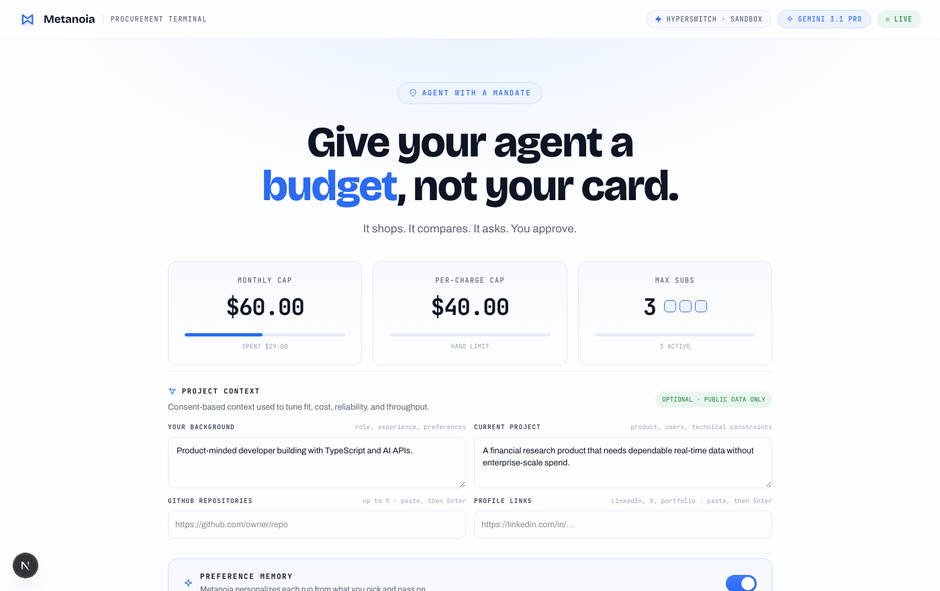
</p>

---

## What is Metanoia?

Autonomous agents increasingly need to **spend money** by subscribing to APIs, renewing tools, and buying compute. Handing an agent a raw credit card is reckless. Metanoia is the missing primitive: a **safe delegation envelope**.

You give the agent a **capability you need** and a **spending mandate** (default: `$60/mo` total, `$40` per charge, `3` subscriptions max, editable in the workbench). It shops a curated marketplace, ranks the best offers with a **deterministic formula** (not the model's opinion), runs **four parallel analyst "scouts"**, checks the winner against a **deterministic gate (SpendGuard)** that refuses over-budget purchases *before any money moves*, asks you to confirm, then **settles through Juspay Hyperswitch** and proves the capability works by calling it live.

> **The core safety idea:** the language model can research, compare, and recommend, but it can **never** set a price, choose the final plan, or move money. A deterministic ranker and SpendGuard are the only authority. *Metanoia* (Greek: a fundamental turning of the mind) is the thesis: a change in how software gets bought.

---

## How it works

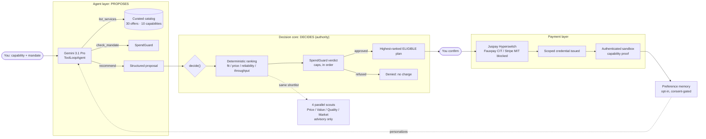

**In one sentence:** you delegate a budget, the model proposes under an untrusted-context boundary, the server ranks + gates the purchase deterministically, four scouts weigh in without authority, Hyperswitch settles, and a real credentialed call proves the capability.

---

## The two things that make it safe

### 1) Deterministic ranking (the model does not score)

A fixed formula runs on **server-owned catalog numbers**. It is reproducible and explainable. Weights shift with the requested priority:

| priority | fit | price | reliability | throughput |
|---|---:|---:|---:|---:|
| cost | 30 | **45** | 15 | 10 |
| balanced | **35** | 30 | 20 | 15 |
| reliability | 30 | 15 | **40** | 15 |
| throughput | 30 | 15 | 15 | **40** |

`score = fit·w1 + priceEfficiency·w2 + reliability·w3 + throughput·w4` → the highest-ranked **eligible** plan wins. Hard failures (over budget, below min throughput, missing feature) make a plan ineligible regardless of score. *(see `lib/agent/ranking.ts`)*

### 2) SpendGuard: the Spending Constitution

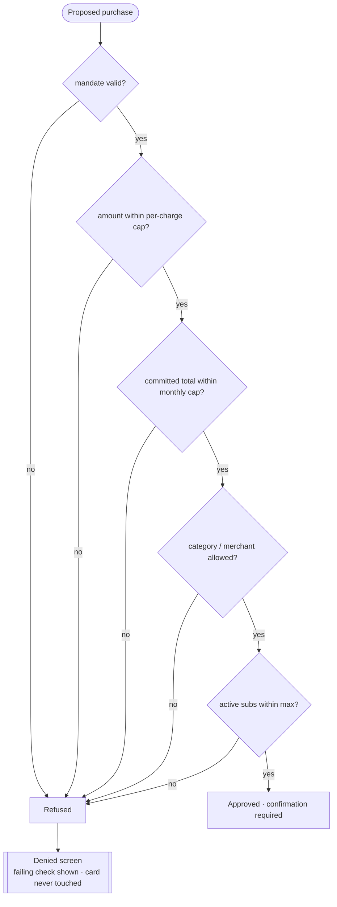

Every autonomous purchase is checked **in order, before any money moves**, and the checkout route re-runs SpendGuard and returns `403` before Hyperswitch is ever contacted. A refusal is a first-class, explainable outcome, not an error. *(see `lib/agent/spendCap.ts`)*

---

## The four parallel scouts

Four independent analyst agents review the same shortlist at once. They **advise**; they never decide or pay.

| Scout | Lens | Scope | Tooling |
|---|---|---|---|
| **Price** | lowest cost among equally-qualified | `onboarded_catalog` | structured report |
| **Value** | feature coverage / utility per dollar | `onboarded_catalog` | structured report |
| **Quality** | uptime, throughput, transport, ops fit | `onboarded_catalog` | structured report |
| **Market Signal** | the real external market | `external_research` | **Google Search grounding** |

The Market scout names real products as **research-only** (clearly labeled "NOT ONBOARDED"), so researched providers are never confused with purchasable sandbox offers. Any scout that fails is marked `unavailable` and **never blocks procurement**. *(see `lib/agent/scouts.ts`)*

---

## Payment sequence (Hyperswitch)

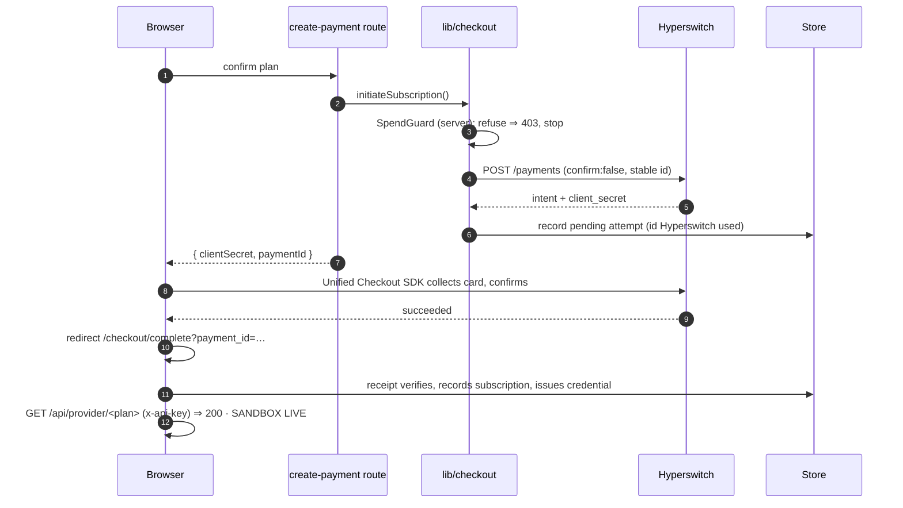

- **Idempotency:** merchant-supplied stable ids (`pay_` + 26 hex = 30 chars), seeded per `customer:plan:period`; retries reuse the id; `HE_01` self-heals.
- **Webhooks:** real signed events pass through an HMAC-verifying ingress, are re-verified over the raw body by Cloud Run, deduped by `event_id`, and settled atomically in Cloud SQL; unknown events are retained, never dropped.
- **Honest boundary:** checkout uses **Fauxpay** (a dummy sandbox connector). Real off-session recurring (MIT) needs the **Stripe** path and remains connector-blocked. *(see `lib/hyperswitch.ts`, `lib/checkout.ts`)*

---

## Data model: payments and memory are walled off

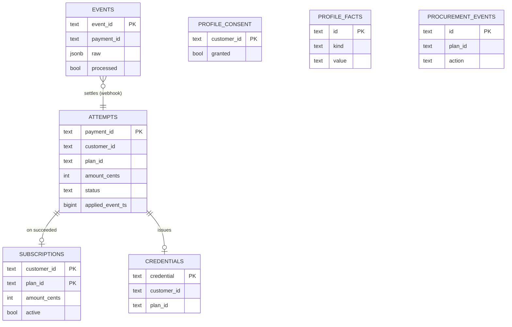

Payment tables live in `public.*`; preference memory lives in a **separate `memory.*` schema** with no foreign key crossing the wall. Locally the store is in-memory (disk-backed); in production it's **Cloud SQL Postgres via Drizzle + the Cloud SQL connector**. *(see `lib/db/`)*

---

## Screens

| Workbench (mandate + context) | Procuring (four scouts, live) |
|---|---|
| 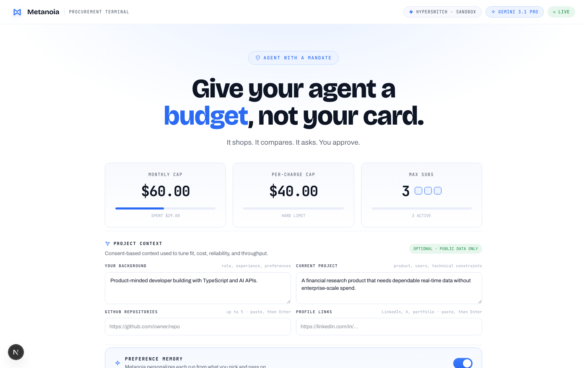 | 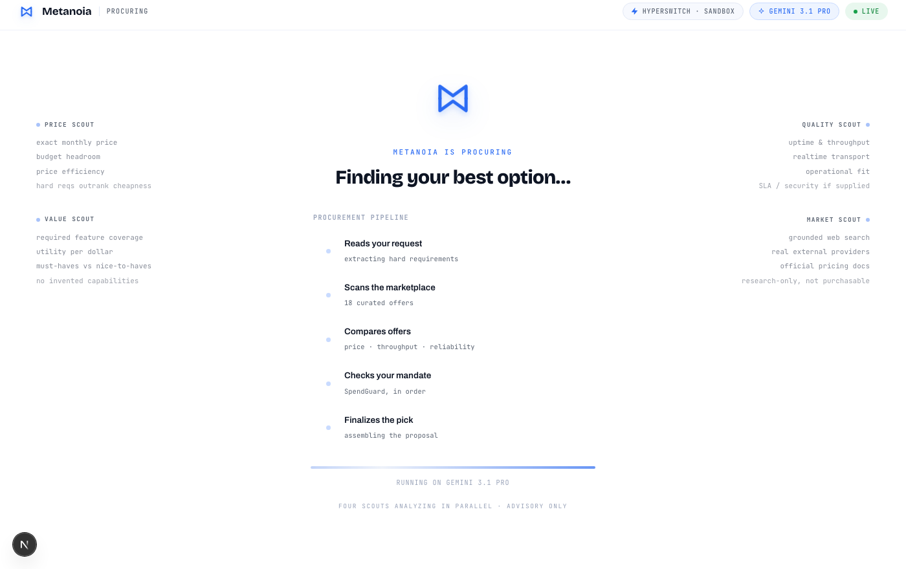 |

| Ranked result + SpendGuard audit + scouts | Denied (real cap breach) |
|---|---|
| 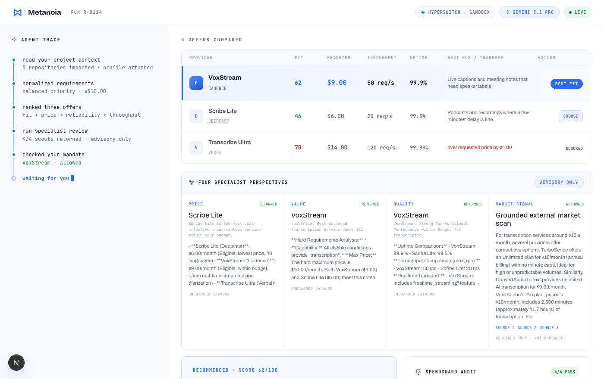 | 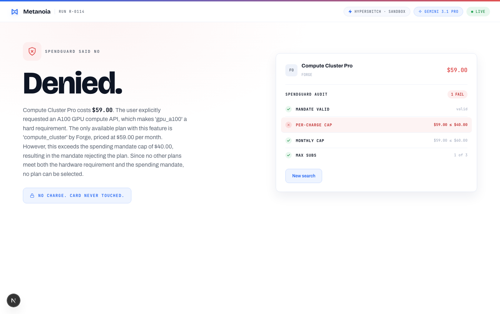 |

| Checkout (Hyperswitch Unified Checkout) | Receipt + authenticated capability proof |
|---|---|
| 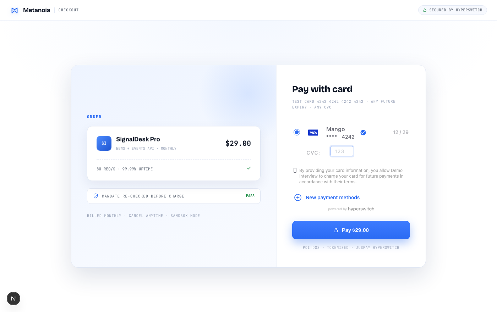 | 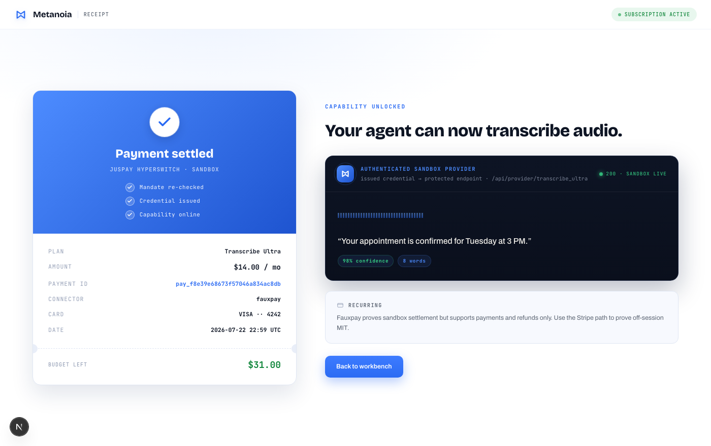 |

### The finish: buy, then prove the capability

<p align="center">
  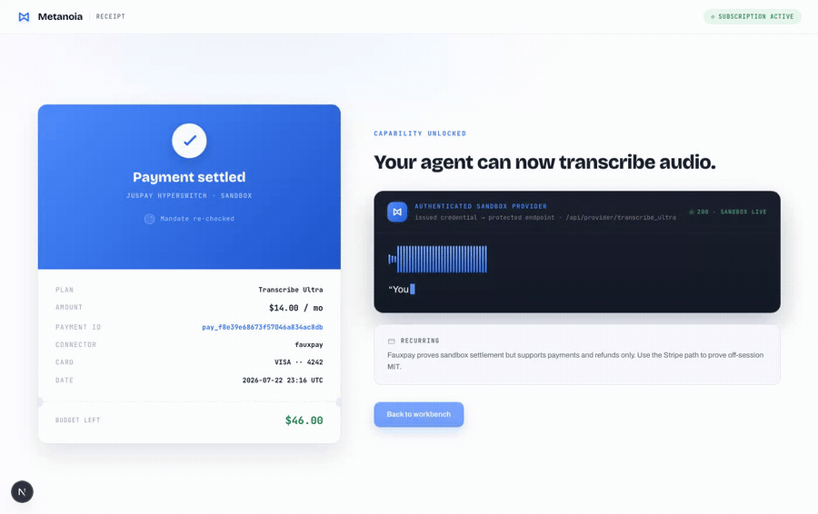
</p>

On success the receipt makes a **real credentialed call** to the purchased capability's protected sandbox endpoint and animates the response. Here, a transcription waveform types out its text under a staggered *Mandate re-checked → Credential issued → Capability online* tick sequence.

---

## Feature highlights

- **Agentic procurement:** Gemini 3.1 Pro on Vertex proposes; a deterministic core decides.
- **SpendGuard:** mandate enforced before any charge; refusals are explainable.
- **Four advisory scouts:** price / value / quality / grounded market signal, in parallel.
- **Real payment rails:** Juspay Hyperswitch (sandbox), idempotent, with signed webhook settlement proven live.
- **Buy-then-use loop:** a scoped credential + a live authenticated capability proof.
- **Opt-in preference memory:** consent-gated, deletable, walled off from payments.
- **Configurable mandate:** caps are editable in the workbench.
- **95/95 tests:** the safety gate, ranking math, idempotency, ownership, refunds, and webhook recovery are covered.

---

## Tech stack

| Layer | Tech |
|---|---|
| Frontend | Next.js 16 (App Router), React 19, Tailwind v4, hand-built SVG/CSS motion |
| Agent | `@ai-sdk/google-vertex`, AI SDK `ToolLoopAgent`, Gemini 3.1 Pro (agent) + 2.5 Flash (scouts) |
| Decision core | Deterministic ranking + SpendGuard (pure, unit-tested) |
| Payments | Juspay Hyperswitch (Unified Checkout SDK + server API), Fauxpay / Stripe connectors |
| Storage | `Store` / `MemoryStore` interfaces · in-memory (disk-backed) · **Cloud SQL Postgres via Drizzle + cloud-sql-connector** |
| Tests | Vitest (95 tests, 17 files) |

---

## Quickstart

```bash
git clone https://github.com/theaayushstha1/metanoia.git
cd metanoia
npm install

# configure secrets (never committed); see .env.local.example
cp .env.local.example .env.local
# HYPERSWITCH_SECRET_KEY, NEXT_PUBLIC_HYPERSWITCH_PUBLISHABLE_KEY
# GOOGLE_VERTEX_PROJECT  (+ `gcloud auth application-default login` for local dev)

npm run dev        # http://localhost:3000
npm test           # 95/95
```

Test card at checkout: `4242 4242 4242 4242`, any future expiry, any CVC.

> **Durable state:** the live deployment uses Cloud SQL Postgres. For another deployment, set `CLOUD_SQL_*`, run `npm run db:migrate`, and the store switches from in-memory automatically.

---

## Testing

`npm test` → **95/95 across 17 files** (plus `tsc` clean, `lint` clean). The suites prove the parts that must never break:

- **can't overspend:** SpendGuard refuses over-cap purchases; checkout returns 403 without calling Hyperswitch.
- **can't be tricked:** the server overrides an over-cap model pick; rejects hallucinated / wrong-capability plans.
- **agent can't touch money:** a test asserts the agent module imports no payment functions.
- **idempotent:** same period means the same payment id; confirming twice records one subscription; stale webhooks are ignored.
- **memory is consent-gated:** nothing is stored until opt-in; `deriveProfile` is deterministic; delete works.

---

## Honest boundaries (what's real vs sandbox)

- The provider endpoints (`/api/provider/*`) are an **authenticated internal sandbox mock**, not external vendor APIs. A `200` proves *our* credential works against *our* protected endpoint (labeled "AUTHENTICATED SANDBOX PROVIDER · 200 · SANDBOX LIVE").
- Catalog vendors are **fictional sandbox offers**. Real brands appear only via the Market scout as `external_research`, never as purchasable.
- Payment settles via **Fauxpay** (sandbox CIT). Real off-session **MIT / recurring** needs Stripe and is not yet proven.
- **AP2** mandate *shapes* are modeled and enforced app-side; cryptographic signatures / JWTs are roadmap.
- The public app is deployed on **Cloud Run** with durable **Cloud SQL Postgres**, Vertex AI, and secrets mounted from Secret Manager.
- Signed webhook delivery and settlement are live through a narrow HMAC-verifying ingress; real off-session MIT remains separate and unproven.

---

## Roadmap

- **P0 completed:** Cloud SQL migrations, public Cloud Run deployment, and real signed webhook settlement.
- **P1 real recurring:** Stripe MIT off-session charge, automatic renewal scheduler, and decline-code-aware smart retries (Revenue Recovery).
- **P2 protocol depth:** signed AP2 Checkout/Payment mandates (JWTs); x402 pay-per-call handshake; smart routing / connector failover; OAuth profile import.

---

## Documentation

| Doc | What's in it |
|---|---|
| [`docs/ARCHITECTURE.md`](docs/ARCHITECTURE.md) | System, request-flow, payment, and data diagrams; storage design; component map. |
| [`docs/DECISIONS.md`](docs/DECISIONS.md) | Architecture decision records: every major call, its alternatives, and tradeoffs. |
| [`docs/submission/Metanoia-Architecture-Decisions.pdf`](docs/submission/Metanoia-Architecture-Decisions.pdf) | The recruiter-ready architecture and decisions document (3 pages). |
| [`docs/METANOIA-WALKTHROUGH.md`](docs/METANOIA-WALKTHROUGH.md) · [PDF](docs/METANOIA-WALKTHROUGH.pdf) | The full 18-page technical walkthrough (also a great NotebookLM source). |

---

<p align="center">
  <sub>Built by <a href="https://github.com/theaayushstha1">@theaayushstha1</a> · sandbox prototype · no real funds move · secrets live only in <code>.env.local</code></sub>
</p>
