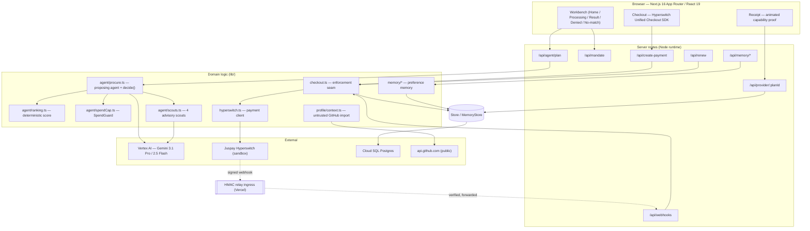
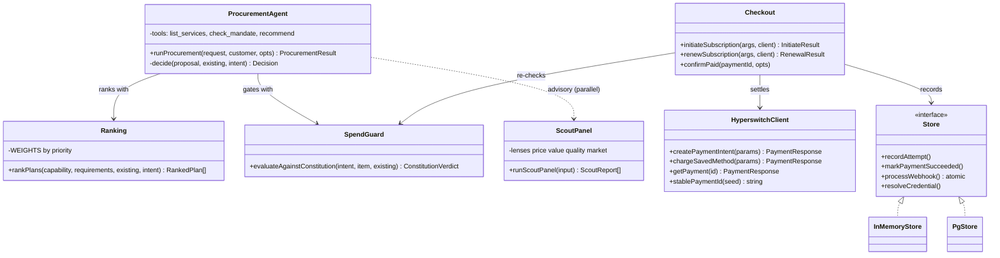
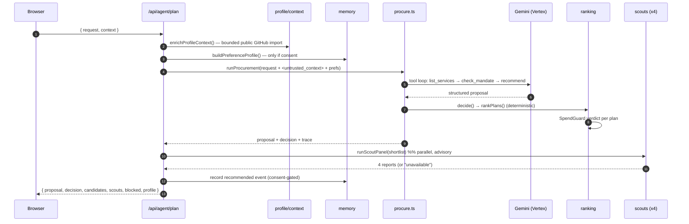
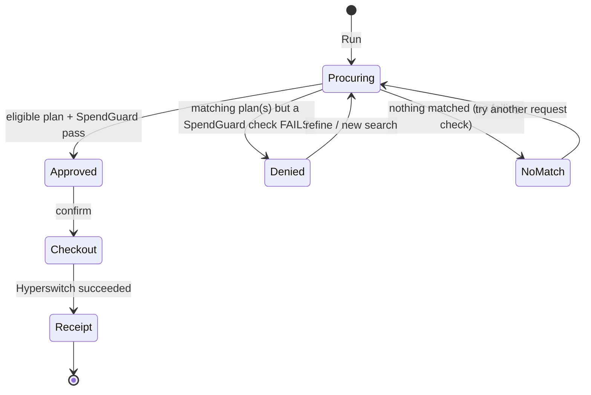
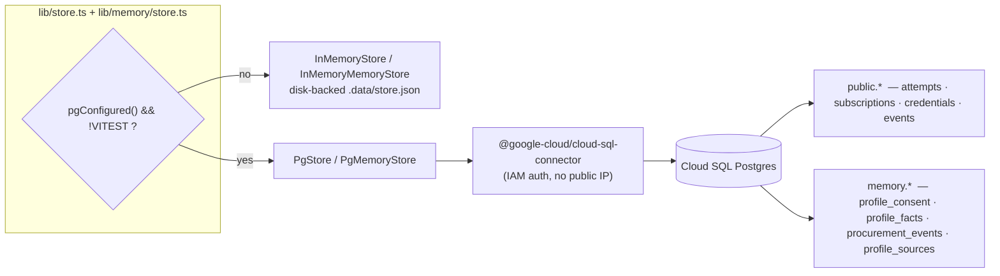

# Architecture

Deep-dive into how Metanoia is built. Diagrams are [Mermaid](https://mermaid.js.org/) (GitHub renders them
natively) and read as text for accessibility. See also [`DECISIONS.md`](DECISIONS.md) for the *why*, and the
[full walkthrough](METANOIA-WALKTHROUGH.md) for exhaustive detail.

> **One-line mental model:** the LLM **proposes**, a deterministic core **decides**, Hyperswitch **settles**.
> Authority never leaves deterministic, server-owned, unit-tested code.

---

## 1. Layered architecture



**Authority boundary:** everything in `CORE` that can move money (`checkout.ts`, `hyperswitch.ts`) is unreachable
from `agent/procure.ts`. `RANK` + `GUARD` are pure functions of server-owned data.

---

## 2. Component model (UML)



---

## 3. Procurement request lifecycle



---

## 4. Payment: CIT, MIT, and webhook

```mermaid
sequenceDiagram
    autonumber
    participant B as Browser
    participant CO as lib/checkout
    participant HS as Hyperswitch
    participant RLY as Relay ingress (Vercel)
    participant S as Store

    rect rgb(238,244,255)
    note over B,S: Customer-initiated (checkout)
    B->>CO: initiateSubscription()
    CO->>CO: SpendGuard — refuse ⇒ 403 (Hyperswitch never called)
    CO->>HS: POST /payments (confirm:false, stable id, setup_future_usage)
    CO->>S: record pending attempt
    B->>HS: Unified Checkout confirms card ⇒ succeeded
    B->>S: receipt: verify → subscription + credential
    end

    rect rgb(232,247,238)
    note over CO,S: Merchant-initiated renewal (off-session)
    CO->>CO: evaluateRenewal() — SpendGuard again
    CO->>S: write PENDING attempt (durable) BEFORE charge
    CO->>HS: chargeSavedMethod(sameId, off_session, recurring_details)
    CO->>S: settle succeeded ⇒ confirmPaid, else markPaymentFailed
    end

    rect rgb(232,247,238)
    note over HS,S: Webhook (async, signed) — LIVE-VERIFIED
    HS-->>RLY: POST signed event (reaches the relay; direct *.run.app does not land, transport reason unconfirmed)
    RLY->>RLY: verify HMAC (SHA-512/256) over the raw body
    RLY-->>S: forward the untouched raw body to /api/webhooks
    S->>S: verify HMAC again (timing-safe)
    S->>S: ONE tx: dedupe(event_id) → settle → upsert subscription → issue credential
    note right of S: unknown payment ⇒ event retained (processed=false), never dropped
    end
```

---

## 5. Result state machine



`Denied` (red, "SPENDGUARD SAID NO") and `NoMatch` (neutral, "nothing to compare") are **distinct** outcomes —
a budget refusal must never masquerade as "we don't carry that."

---

## 6. Storage architecture



- **Correctness is a database property:** `payment_id` PK (idempotent), `subscriptions` composite PK (upsert),
  `credentials` unique(customer,plan) (issued once), `events.event_id` PK (webhook dedupe).
- **Local persistence:** the in-memory store writes `.data/store.json` and re-reads on each lookup, so a
  credential issued during a receipt render is visible to the provider route in a different Next context.

---

## 7. Trust boundaries (security)

```mermaid
flowchart TB
    subgraph UNTRUSTED
        REQ["user request"]
        GHD["public GitHub metadata"]
        SOC["profile links (reference only)"]
    end
    REQ & GHD --> WRAP["&lt;untrusted_project_context&gt;<br/>'data, not instructions'"]
    WRAP --> LLM["Gemini agent"]
    LLM -->|proposal only| DET["deterministic decide()"]
    DET --> MONEY["Hyperswitch"]
    SOC -.never fetched.-> X((x))
    GHD -.only github.com/owner/repo.-> SAFE["SSRF-guarded fetch"]

    style MONEY fill:#e8f7ee,stroke:#12873c
    style LLM fill:#eef4ff,stroke:#2b6bf3
```

- Prompt injection: context wrapped and labeled as data; scouts repeat the rule; the model has no payment tool.
- SSRF: only `github.com/owner/repo` URLs are fetched, with a 5s timeout and length caps.
- Secrets: the Hyperswitch **secret key stays server-side**; the browser only ever sees the publishable key +
  a per-payment `client_secret`. Vertex uses ADC / a service-account JSON. No secrets in this repo's docs.

---

## 8. Component map

| Path | Responsibility |
|---|---|
| `app/Workbench.tsx` | Client workbench: home, processing (4 scouts), result, denied, no-match, mandate tuner. |
| `app/api/agent/plan/route.ts` | Orchestrates a procurement: context → memory → agent → ranking → scouts → learning. |
| `app/api/create-payment/route.ts` | SpendGuard-gated checkout intent; records a `selected` memory event. |
| `app/api/renew/route.ts` | Off-session renewal (MIT). |
| `app/api/webhooks/route.ts` | Raw-body HMAC verification + atomic settlement. |
| `app/api/provider/[planId]/route.ts` | Credential-gated internal **sandbox** provider (the "used capability"). |
| `app/api/mandate/route.ts` | Persists the user-authored mandate for the session. |
| `app/checkout/*` | Hyperswitch Unified Checkout; receipt; animated capability proof; renew panel. |
| `lib/agent/procure.ts` | Proposing agent, its three tools, and server `decide()`. |
| `lib/agent/ranking.ts` | Deterministic scoring formula + eligibility. |
| `lib/agent/scouts.ts` | Four parallel advisory scouts (3 catalog + 1 grounded market). |
| `lib/agent/spendCap.ts` | SpendGuard — the Spending Constitution evaluator. |
| `lib/ap2/mandate.ts` | AP2 mandate/cart shapes + the policy extension. |
| `lib/catalog.ts` | 30-offer sandbox marketplace + deterministic search. |
| `lib/checkout.ts` | Enforcement seam: initiate, confirm, evaluateRenewal, renew. |
| `lib/hyperswitch.ts` | Server Hyperswitch client (intent, MIT charge, get, stable id, self-heal). |
| `lib/profile/context.ts` | Bounded public GitHub import + untrusted-context prompt. |
| `lib/db/` · `lib/store*.ts` · `lib/memory/` | Store/MemoryStore interfaces; in-memory + Cloud SQL backends; Drizzle schemas. |

---

## External references

- Juspay Hyperswitch — <https://docs.hyperswitch.io>
- Vertex AI / Gemini — <https://cloud.google.com/vertex-ai>
- AI SDK — <https://ai-sdk.dev>
- Drizzle ORM — <https://orm.drizzle.team>
- Cloud SQL Node connector — <https://github.com/GoogleCloudPlatform/cloud-sql-nodejs-connector>
- AP2 (Agent Payments Protocol) — <https://ap2-protocol.org>
- x402 — <https://x402.org>
